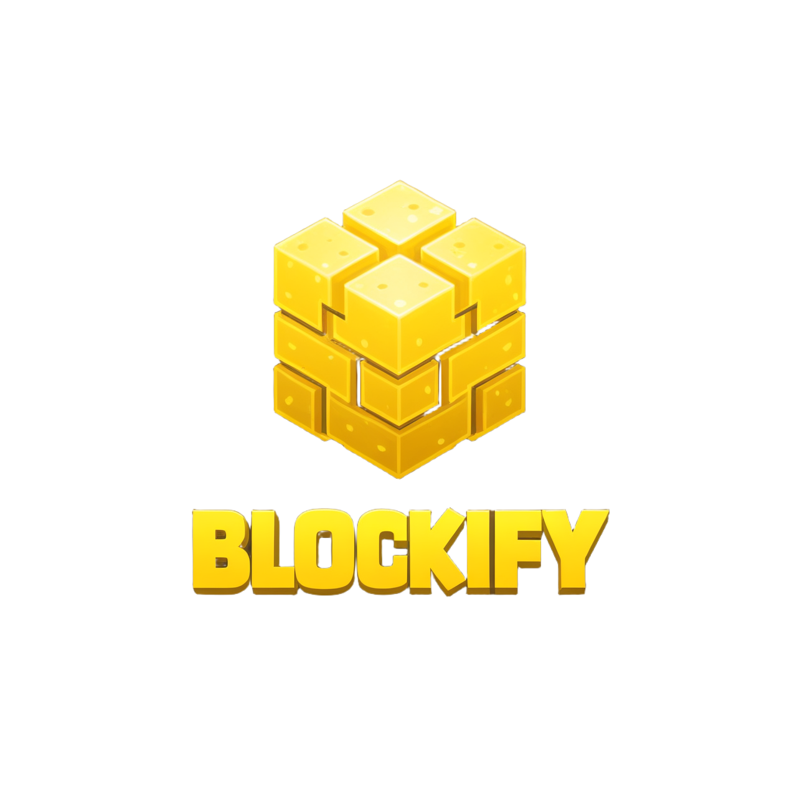

    

  

# About
Ever wondered how servers like FadeCloud or AkumaMC do private farms and mines?
Well, let Blockify take care of it for you! Blockify is a public library that can manage and create client-sided blocks.

Check out the [Wiki](https://github.com/Kooperlol/Blockify/wiki) to get started, and join the [Discord](https://discord.gg/BKrSKqaAZp) for help.

## Features
1. **Stage Management**: Blockify has different stages for an audience. Each stage has multiple "views", which represent different patterns within a stage.
2. **Block Interaction Events**: The project handles block interaction events, such as starting to dig a block, as seen in the `BlockDigAdapter` class.
3. **Block Breaking Events**: Blockify also handles block-breaking events, including checking if a block is breakable and sending block change updates to the player.
4. **Chunk Loading**: The `ChunkLoadAdapter` class handles chunk-loading events, including sending block changes to the player.
5. **Game Mode Checks**: The project checks the player's game mode and adjusts block-breaking speed accordingly.
6. **Memory Management**: Blockify manages memory efficiently by using custom data types like `BlockifyPosition` and `BlockifyChunk`.
7. **Skript Support**: Blockify has a Skript Addon, [SkBlockify](https://github.com/Kooperlol/SkBlockify), that allows you to use Skript to manage client-sided blocks.
8. **Custom Events:** Blockify has a custom event `BlockifyBlockBreakEvent` that is called when a block is broken. 
9. **Complex Block Patterns:** Blockify can handle complex block patterns using the `BlockifyPattern` class. In addition, it can handle setting crop ages and other custom block data.
10. **Custom Mining Speeds:** Blockify allows for custom mining speeds which you can set for a player in an audience.

## Dependencies
- [PacketEvents](https://github.com/retrooper/packetevents)

## Statistics
Check out our [bStats page](https://bstats.org/plugin/bukkit/Blockify/21782)
